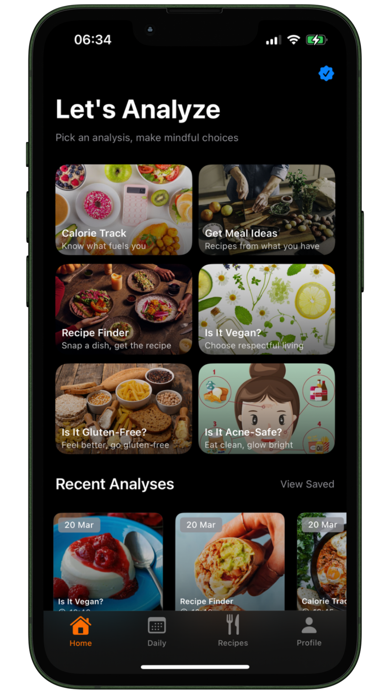
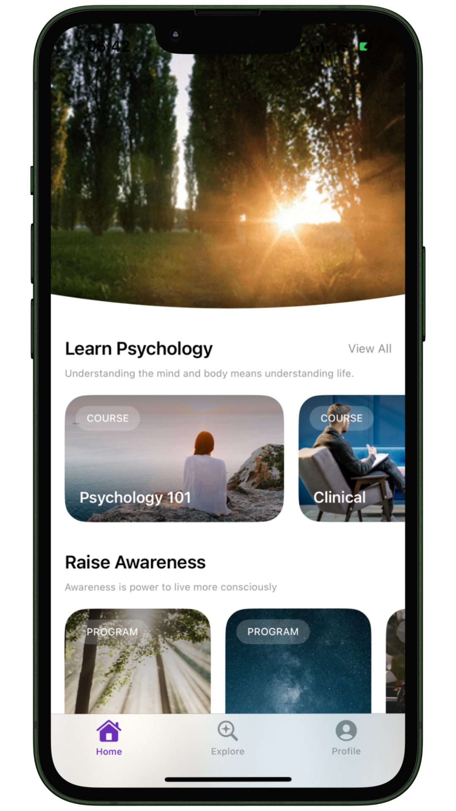
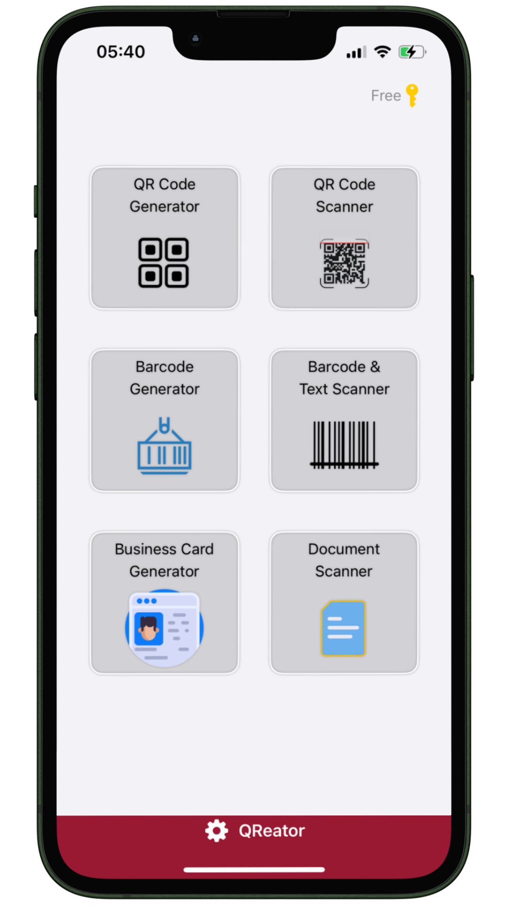
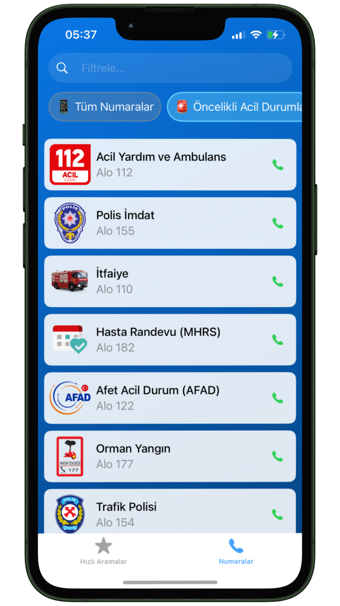
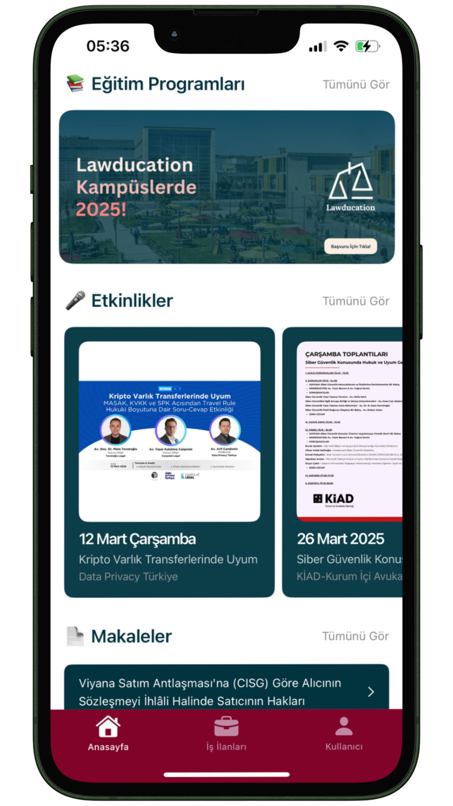

# Hello, I'm Tunahan
I graduated with high honors in Psychology and gained multidisciplinary skills through work and volunteering. I took a gap year to learn iOS development with SwiftUI through self-study and online courses from Stanford University, Kodeco, Hacking With Swift, Essential Developer, and Sean Allen. I have published five iOS applications—4 under my own name and 1 as freelance project. Currently, I am maintaining my previously published apps while developing a new personal project. I am eager to join a work environment where I can collaborate with others and continue learning, and I am confident that my passion and dedication to iOS development will allow me to contribute to a team and grow as a developer.

## My Apps

  <table border="0">
    <tr>
      <td align="center">
        
      </td>
      <td align="center">
        
      </td>
      <td align="center">
        
      </td>
    </tr>
    <tr>
      <td align="center">
        
      </td>
      <td align="center">
        
      </td>
    </tr>
  </table>

[Foodr](https://apps.apple.com/app/id6742585033) | [Lawducation](https://apps.apple.com/tr/app/lawducation-hukuk-e.itim/id6739732386?l=tr) | [Psychpedia](https://apps.apple.com/tr/app/psychpedia-psychology-focus/id6472971185)

[QReator](https://apps.apple.com/tr/app/qreator-qr-kod-barkod-okuyucu/id6737692733?l=tr) | [Acil Numaralar](https://apps.apple.com/tr/app/acil-numaralar-türkiye/id6505045783?l=tr)

## Technologies I Know
- SwiftUI
- Git
- Fastlane
- Github Actions
- RESTful APIs
- RevenueCat
- Admob
- Firebase
- Figma
- NextJs

## Contact
- LinkedIn: [Tunahan Aktay](https://linkedin.com/in/tunahan-aktay)
- Twitter: [@tunimba](https://twitter.com/tunimba)
- E-mail: [aktaytunahan@gmail.com](mailto:aktaytunahan@gmail.com)
